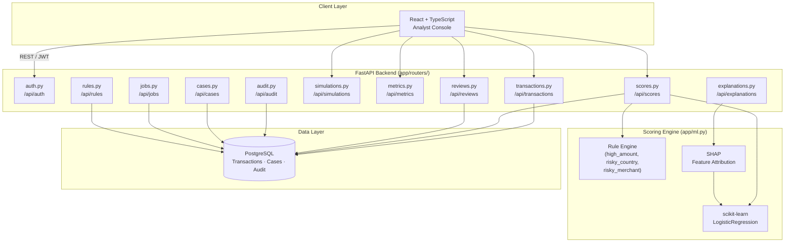

# Meridian

**Real-Time Fraud Detection & Risk Analytics Platform (Portfolio Project)**

[**UI / Portfolio Design Preview →**](https://www.perplexity.ai/computer/a/meridian-preview-project-9-of-lCA5DWRgQoa4AN6VYPXAUQ)

> A portfolio-grade fraud detection system combining a hybrid rules + ML risk
> scoring engine with SHAP explainability, an analyst review workflow, and a
> real-time analytics dashboard. **Built and evaluated entirely on synthetic
> data — not a production fraud-prevention product.**

---

## 🎬 Recruiter Demo in 2 Minutes

Short on time? Skim these five things in order:

1. **What it is** — a FastAPI + React fraud-scoring platform with rules + ML, SHAP explainability, an analyst review queue, KPI dashboards, and a seeded fraud-scenario simulator.
2. **Live preview** — click the [UI / Portfolio Design Preview](https://www.perplexity.ai/computer/a/meridian-preview-project-9-of-lCA5DWRgQoa4AN6VYPXAUQ) for a hosted UI walkthrough (no install required).
3. **Architecture at a glance** — see the [Mermaid diagram](#-architecture) below, or read [`docs/architecture.md`](docs/architecture.md) for the layered breakdown.
4. **API surface** — 30+ REST endpoints documented in [`docs/api.md`](docs/api.md); Swagger UI at `http://localhost:8000/docs` after `docker compose up`.
5. **Resume / interview material** — ATS-friendly bullets in [`docs/resume-bullets.md`](docs/resume-bullets.md); guided walkthrough in [`docs/demo-runbook.md`](docs/demo-runbook.md).

> **Responsible-use note:** The dataset is hand-generated and the model is a
> baseline classifier. Treat every metric as illustrative. This project does
> not handle real cardholder data and is not a substitute for a licensed
> fraud-prevention system.

---

## 📋 Project / Technical Snapshot

| Item | Detail |
|---|---|
| **Project name** | Meridian — Real-Time Fraud Detection & Risk Analytics |
| **Type** | Personal portfolio project (not a deployed product) |
| **Backend** | FastAPI 0.111+, SQLAlchemy 2.x, PostgreSQL 16, JWT auth |
| **ML stack** | scikit-learn `LogisticRegression` baseline + rule layer; SHAP for explainability |
| **Frontend** | React + TypeScript + Vite |
| **Infra** | Docker Compose (postgres + backend + frontend) |
| **CI** | GitHub Actions — backend (ruff + mypy + pytest) and frontend (eslint + tsc + vite build) |
| **Backend routers** | 11 (`auth`, `transactions`, `scores`, `explanations`, `reviews`, `simulations`, `metrics`, `audit`, `jobs`, `cases`, `rules`) |
| **Backend tests** | 4 pytest modules (`test_api.py`, `test_coverage.py`, `test_offline_pipeline.py`, `test_services.py`) |
| **Data** | `data/synthetic_transactions.csv` — 2,000 rows, `seed=42`, ~7% fraud rate, generated by `scripts/generate_synthetic_dataset.py` |
| **Offline training** | `scripts/train_offline_model.py` — shares the live API's feature extractor; logistic regression baseline |
| **RBAC** | Admin / Analyst / Reviewer / Viewer (JWT-issued roles) |
| **License** | MIT |

All facts above are verifiable against the files in this repo (`backend/app/`, `scripts/`, `data/`, `.github/workflows/`).

---

## 💡 What This Project Demonstrates

For recruiters, hiring managers, and interviewers — what you can take away from reading this codebase:

- **Full-stack delivery** — designing, implementing, and wiring together a Python API, a React/TypeScript console, a PostgreSQL schema, Docker Compose orchestration, and a CI pipeline.
- **Applied ML in a product context** — not just a notebook: a hybrid rules + ML scorer with feature engineering shared between the live API and the offline training script, plus SHAP-based per-decision explanations.
- **Responsible-ML thinking** — auditable decisions (rule reason codes + SHAP factors), role-based access for human-in-the-loop review, decision history, and an explicit synthetic-data disclaimer.
- **Production-style ergonomics** — request-ID middleware, structured JSON access logs, health/readiness endpoints, background job tracking, audit logs, and Pydantic-validated payloads.
- **Testability** — pytest coverage for the scoring API, review workflow, and offline pipeline; CI gates lint, type-check, and tests on every PR.
- **Communication** — Mermaid architecture diagram, API reference, demo runbook, and resume bullets — all kept in the repo so reviewers can self-serve.

---

## 🏗️ Architecture



See [`docs/architecture.md`](docs/architecture.md) for the layered breakdown.

---

## ⭐ Key Technical Highlights

- **Hybrid scoring** — rule signals (`is_high_amount`, `is_risky_country`, `merchant_risk`) and an ML probability are combined into a single risk score with approve / review / decline thresholds and persisted reason codes (`backend/app/ml.py`, `backend/app/routers/scores.py`).
- **SHAP per-decision explanations** — the API returns the top-3 contributing features per transaction plus a human-readable narrative for the analyst console (`backend/app/routers/explanations.py`).
- **Reusable feature extractor** — the live API and the offline training script (`scripts/train_offline_model.py`) both import `extract_features` from `app.ml`, so what you train on is what you score on.
- **Deterministic fraud simulator** — `POST /api/simulations/run-demo?seed=42` seeds a realistic mix (card testing, geo attack, account takeover, bot activity) for reproducible demos and evaluation.
- **Analyst-grade workflow** — review queue, assignment, decision history, AI-assisted suggestion, and a full audit trail (`backend/app/routers/reviews.py`, `backend/app/routers/audit.py`).
- **Background jobs + ops surface** — feature-refresh jobs with retry, queue health counters, and structured request-ID logging on every response (`backend/app/main.py`, `backend/app/routers/jobs.py`).
- **RBAC** — four JWT-scoped roles (Admin, Analyst, Reviewer, Viewer) gate sensitive endpoints (rules management, simulation seeding) at the API layer.
- **CI gates everything** — `make check` runs ruff + pytest + eslint + tsc + vite build, mirrored by `.github/workflows/ci.yml`.

---

## 📷 Screenshots / Demo

Screenshots live under [`docs/screenshots/`](docs/screenshots/). See
[`docs/screenshots/README.md`](docs/screenshots/README.md) for the recommended
capture list and dimensions.

Suggested captures (PNG, ~1280px wide):

| File | What it shows |
|---|---|
| `dashboard-kpis.png` | KPI cards + fraud trend on the analyst dashboard |
| `review-queue.png` | Fraud review queue with case statuses and assignment |
| `transaction-detail.png` | Risk score output + threshold + decision on a single transaction |
| `shap-explanation.png` | SHAP top-factor breakdown for a flagged transaction |
| `model-evaluation.png` | Model evaluation table (F1 / AUC / Brier / cost-sensitive) |
| `swagger-docs.png` | FastAPI Swagger UI at `/docs` |

Until those PNGs are added, recruiters can use the
[UI / Portfolio Design Preview](https://www.perplexity.ai/computer/a/meridian-preview-project-9-of-lCA5DWRgQoa4AN6VYPXAUQ).

---

## 📷 Features

- **Transaction ingestion** — submit transactions and receive real-time ML risk scores
- **Hybrid scoring engine** — combined rule-based + ML risk model with SHAP feature attribution
- **Review queue** — analyst triage workflow with case assignment, decision history, and status tracking
- **Fraud Lab** — seeded simulation runner for model evaluation and case cluster analysis
- **Model evaluation** — precision, recall, F1, ROC-AUC, Brier score, and confusion matrix
- **Live dashboard** — KPI cards, trend charts, and alert feed updated after each score cycle
- **One-click demo bootstrap** — generates and scores a realistic mixed fraud dataset in one API call

---

## 🛠️ Tech Stack

| Layer | Technology |
|---|---|
| Backend API | FastAPI + SQLAlchemy + PostgreSQL |
| ML & Explainability | scikit-learn (LogisticRegression) + SHAP |
| Frontend | React + Vite + TypeScript |
| Infra | Docker Compose + GitHub Actions CI |

---

## 🚀 How to Run Locally

### Prerequisites
- Docker + Docker Compose
- Python 3.11+
- Node.js 20+

### Docker (recommended)
```bash
docker compose up --build
# Frontend:         http://localhost:5173
# Backend API docs: http://localhost:8000/docs
```

### Local development
```bash
# Backend
cd backend && pip install -e .[dev]
cp .env.example .env  # optional — defaults are wired in for local
uvicorn app.main:app --reload --port 8000

# Frontend
cd frontend && npm ci && npm run dev
```

### One-click demo dataset
```bash
# After logging in via /api/auth/login, replace <TOKEN> with the returned JWT.
curl -X POST "http://localhost:8000/api/simulations/run-demo?seed=42" \
  -H "Authorization: Bearer <TOKEN>"
```

Generates and scores: card testing, high-value geo attack, merchant takeover, stolen card, bot activity, and account takeover scenarios.

### Quality checks
```bash
make check   # backend lint + tests + frontend lint + typecheck + build
```

A guided demo walkthrough lives in [`docs/demo-runbook.md`](docs/demo-runbook.md).

---

## 🗂️ Repository Structure

```
backend/    FastAPI API, fraud scoring engine, SHAP explainability, review workflow, tests
frontend/   Analyst console UI (React + Vite + TypeScript)
data/       Synthetic transaction CSVs for offline training/evaluation (no real data)
scripts/    Synthetic dataset generator + standalone offline training/evaluation script
docs/       Architecture, API reference, demo runbook, resume bullets, screenshots
```

---

## 🧪 Offline Training & Evaluation

The live FastAPI service ships with a hybrid rules + ML scorer. For
reproducible offline experiments you can also train and evaluate the
classifier directly against a synthetic CSV — using the same feature extractor
the API uses:

```bash
# 1. Generate a deterministic synthetic dataset (~7% fraud rate)
python scripts/generate_synthetic_dataset.py --rows 5000 --out data/synthetic_transactions.csv

# 2. Train and evaluate (logistic regression baseline)
python scripts/train_offline_model.py --data data/synthetic_transactions.csv
```

The training script prints precision, recall, F1, ROC-AUC, a confusion matrix,
and the model's top risk factors (ranked by coefficient magnitude). See
[`docs/resume-bullets.md`](docs/resume-bullets.md) for ATS-friendly bullets and
[`data/README.md`](data/README.md) for the dataset schema.

---

## ⚠️ Limitations & Future Work

This is a **portfolio project, not a production fraud system**. The table
below is intentionally explicit so reviewers know exactly what is and isn't
claimed.

| Area | Current state | Honest limitation | Plausible next step |
|---|---|---|---|
| Data | Synthetic CSV, 2,000 rows, `seed=42` | Not representative of real fraud (no device fingerprints, velocity patterns, behavioral biometrics, adversarial drift) | Integrate a public benchmark (e.g. IEEE-CIS Fraud) under a clearly labeled experiment |
| Model | Logistic regression baseline + small hand-coded training matrix | Tiny training set; no cross-validation in CI; no hyperparameter tuning | Add gradient-boosted baseline, k-fold CV, calibration plots, drift monitoring |
| Explainability | SHAP top-3 factors + narrative summary | Linear model means SHAP is essentially the coefficients × features | Switch to TreeExplainer once the model is non-linear |
| Real-time guarantees | Synchronous scoring inside the FastAPI request | No streaming / Kafka / async queue; no SLA measurement | Move scoring behind a queue, add p50/p95 latency dashboards |
| Security & compliance | Demo passwords seeded in plaintext; JWT + RBAC only | No real customer data, no PII, no SOC2 / PCI / SR 11-7 posture | Plug into a real IdP, rotate secrets, document threat model |
| Deployment | Docker Compose for local only | Not deployed to a cloud provider; no observability stack | Helm chart + managed Postgres + Grafana / OpenTelemetry |
| Cross-border / sanctions | Country-code rules only | No OFAC / sanctions screening, no jurisdiction logic | Wire a sanctions list provider and per-jurisdiction rule packs |

**Responsible-use statement.** The dataset, model, and decisions in this repo
must not be used to make real fraud, credit, or denial-of-service decisions
against real people. The codebase is intended for learning, interviewing, and
portfolio review.

---

## 📝 Resume Bullets (ATS-friendly)

Pick whichever match the target role; full list and skill-keyword variants in
[`docs/resume-bullets.md`](docs/resume-bullets.md).

1. Built a real-time fraud-scoring FastAPI service with a hybrid rules + scikit-learn classifier, SHAP-based top-risk-factor explanations, and per-request decision auditing.
2. Implemented a hybrid risk-scoring engine (rule layer + logistic regression) returning approve / review / decline decisions with persisted reason codes.
3. Engineered SHAP-driven explainability that ranks the top three risk factors per transaction, making model decisions auditable for an analyst review workflow.
4. Designed a synthetic transaction dataset and offline training pipeline producing precision, recall, F1, ROC-AUC, and confusion-matrix reports — sharing feature code with the live API.
5. Shipped a full-stack FinTech analytics platform with FastAPI, SQLAlchemy, scikit-learn, React/TypeScript, Docker Compose, and GitHub Actions CI (lint + typecheck + tests).
6. Built a JWT + RBAC layer (Admin / Analyst / Reviewer / Viewer) and an analyst review queue with assignment, decision history, and a full audit trail.
7. Created a deterministic fraud-scenario simulator (card testing, geo attack, account takeover, bot activity) for reproducible model evaluation and demo data generation.
8. Modeled fraud risk as a binary classification problem with class-balanced training, threshold tuning, and cost-sensitive scoring (FN:FP = 5:1), reported alongside Brier-score calibration.

---

## 👤 Demo Credentials

| Email | Role |
|---|---|
| `admin@meridian.ai` | Admin |
| `analyst@meridian.ai` | Analyst |
| `reviewer@meridian.ai` | Reviewer |
| `viewer@meridian.ai` | Viewer |

All passwords: `password123` (seeded on first launch for demo use only — not a real credential pattern).

---

## 📊 Project Status

| Status | Detail |
|---|---|
| **Stage** | Active portfolio project — feature-complete for demo use |
| **Maintained** | Yes — see `git log` for recent commits |
| **Deployed** | No — runs locally via Docker Compose; the linked UI preview is a hosted design preview |
| **Data** | 100% synthetic; no PII, no real cardholder data |
| **CI** | Green on `main` (backend + frontend pipelines) |
| **Contributions** | Issues welcome; see [`CONTRIBUTING.md`](CONTRIBUTING.md) |

---

## 📝 Key Learnings

- Hybrid rule+ML systems are easier to defend in a regulated context: rules carry hard policy, the model handles the long tail, and SHAP makes every decision explainable.
- Sharing one feature extractor between the live API and the offline trainer eliminates a whole class of training/serving skew bugs — worth the small refactor cost.
- Realistic but synthetic simulation scenarios are the difference between a demo that lands and one that feels like a toy. They're also the only honest way to demo without real data.
- Writing the limitations down (this README, `docs/architecture.md`) is part of the portfolio: it shows you know what production would actually take.

---

## 📄 License

MIT — see [`LICENSE`](LICENSE).
