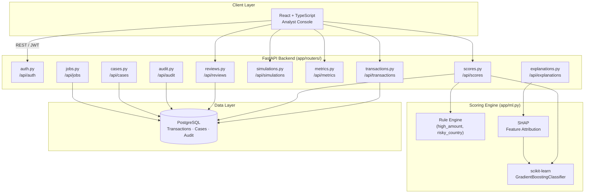

# Meridian

**Real-Time Fraud Detection & Risk Analytics Platform**

[**🔗 View Live Preview →**](https://www.perplexity.ai/computer/a/meridian-preview-project-9-of-lCA5DWRgQoa4AN6VYPXAUQ)

> A production-style fraud detection system combining a hybrid rules + ML risk scoring engine with SHAP explainability, an analyst review workflow, and a real-time analytics dashboard.

---

## 🎯 What I Built & Why

Fraud detection is one of the highest-stakes ML applications — false negatives cost money, false positives erode customer trust. I built this platform to practice the complete lifecycle: from data ingestion and risk scoring to analyst review workflows and model evaluation. Key design decisions:

- **Hybrid rules + ML engine** — rule-based checks catch known fraud patterns instantly, while the ML model handles novel, complex cases. Combining both reduces false positive and false negative rates compared to either approach alone
- **SHAP explainability** — every risk score is backed by a per-feature contribution breakdown, making decisions auditable and analyst-friendly in a regulated context
- **Seeded simulation scenarios** — realistic fraud patterns (card testing bursts, geo attacks, bot activity, account takeover) for convincing, reproducible demos without needing real transaction data
- **Role-based access** — Admin, Analyst, Reviewer, and Viewer roles with distinct UI access patterns reflecting real fraud operations team structures

---

## 🏗️ Architecture



---

## 📷 Features

- **Transaction ingestion** — submit transactions and receive real-time ML risk scores
- **Hybrid scoring engine** — combined rule-based + ML risk model with SHAP feature attribution
- **Review queue** — analyst triage workflow with case assignment, decision history, and status tracking
- **Fraud Lab** — seeded simulation runner for model evaluation and case cluster analysis
- **Model evaluation** — precision, recall, F1, and confusion matrix visualizations
- **Live dashboard** — KPI cards, trend charts, and alert feed updated after each score cycle
- **One-click demo bootstrap** — generates and scores a realistic mixed fraud dataset in one API call

---

## 🛠️ Tech Stack

| Layer | Technology |
|---|---|
| Backend API | FastAPI + SQLAlchemy + PostgreSQL |
| ML & Explainability | scikit-learn + SHAP |
| Frontend | React + Vite + TypeScript |
| Infra | Docker Compose + GitHub Actions CI |

---

## 🚀 Quick Start

### Prerequisites
- Docker + Docker Compose
- Python 3.11+
- Node.js 20+

### Docker (Recommended)
```bash
docker compose up --build
# Frontend:         http://localhost:5173
# Backend API docs: http://localhost:8000/docs
```

### Local Development
```bash
# Backend
cd backend && pip install -e .[dev]
cp .env.example .env
uvicorn app.main:app --reload --port 8000

# Frontend
cd frontend && npm ci && npm run dev
```

### One-Click Demo Dataset
```bash
curl -X POST "http://localhost:8000/api/simulations/run-demo?seed=42" \
  -H "Authorization: Bearer <TOKEN>"
```

Generates and scores: card testing, high-value geo attack, merchant takeover, stolen card, bot activity, and account takeover scenarios.

### Quality Checks
```bash
make check   # backend lint + tests + frontend lint + typecheck + build
```

---

## 🗂️ Repository Structure

```
backend/    FastAPI API, fraud scoring engine, SHAP explainability, review workflow, tests
frontend/   Analyst console UI
data/       Synthetic transaction CSVs for offline training/evaluation (no real data)
scripts/    Synthetic dataset generator + standalone offline training/evaluation script
docs/       Architecture diagram, API reference, demo walkthrough, resume bullets
```

---

## 🧪 Offline Training & Evaluation

The live FastAPI service ships with a hybrid rules + ML scorer. For reproducible
offline experiments you can also train and evaluate the classifier directly
against a synthetic CSV — using the same feature extractor the API uses:

```bash
# 1. Generate a deterministic synthetic dataset (~7% fraud rate)
python scripts/generate_synthetic_dataset.py --rows 5000 --out data/synthetic_transactions.csv

# 2. Train and evaluate (logistic regression baseline)
python scripts/train_offline_model.py --data data/synthetic_transactions.csv
```

The training script prints precision, recall, F1, ROC-AUC, a confusion matrix,
and the model's top risk factors (ranked by coefficient magnitude). See
[`docs/resume-bullets.md`](docs/resume-bullets.md) for ATS-friendly bullets and
[`data/README.md`](data/README.md) for the dataset schema.

---

## ⚠️ Limitations & Responsible-Use Note

- **Synthetic data is not real fraud data.** The included generator hand-codes
  fraud signatures (high amount, risky merchant, risky country). Real bank
  fraud involves device fingerprints, velocity patterns, behavioral biometrics,
  and adversarial drift that this dataset cannot capture. Any precision/recall/
  AUC number from `data/synthetic_transactions.csv` is illustrative, not a claim
  about production performance.
- **Not deployed, not production-grade.** This is a portfolio project. There is
  no real customer traffic, no PII, no regulated data, and no SOC2 / PCI
  posture. Demo credentials are seeded in plain text on first launch.
- **Models are baselines.** Logistic regression and random forest are used to
  keep the training loop fast and dependency-light. A real system would invest
  in feature engineering, drift monitoring, and continuous retraining.
- **No cross-border / regulatory handling.** Production fraud systems need
  jurisdiction-aware rules, sanctions screening (OFAC etc.), and a model risk
  governance process (SR 11-7-style review). None of that is implemented here.

---

## 👤 Demo Credentials

| Email | Role |
|---|---|
| `admin@meridian.ai` | Admin |
| `analyst@meridian.ai` | Analyst |
| `reviewer@meridian.ai` | Reviewer |
| `viewer@meridian.ai` | Viewer |

All passwords: `password123`

---

## 📝 Key Learnings

- Hybrid rule+ML systems outperform either approach alone — rules handle high-confidence known patterns, ML catches the long tail of novel fraud variants
- SHAP values transform a black-box model into an auditable decision system, which is essential for regulated industries where every denial must be explainable
- Realistic simulation scenarios are critical for meaningful model evaluation; synthetic but plausible data exposes edge cases that clean datasets hide

---

## 📄 License

MIT
